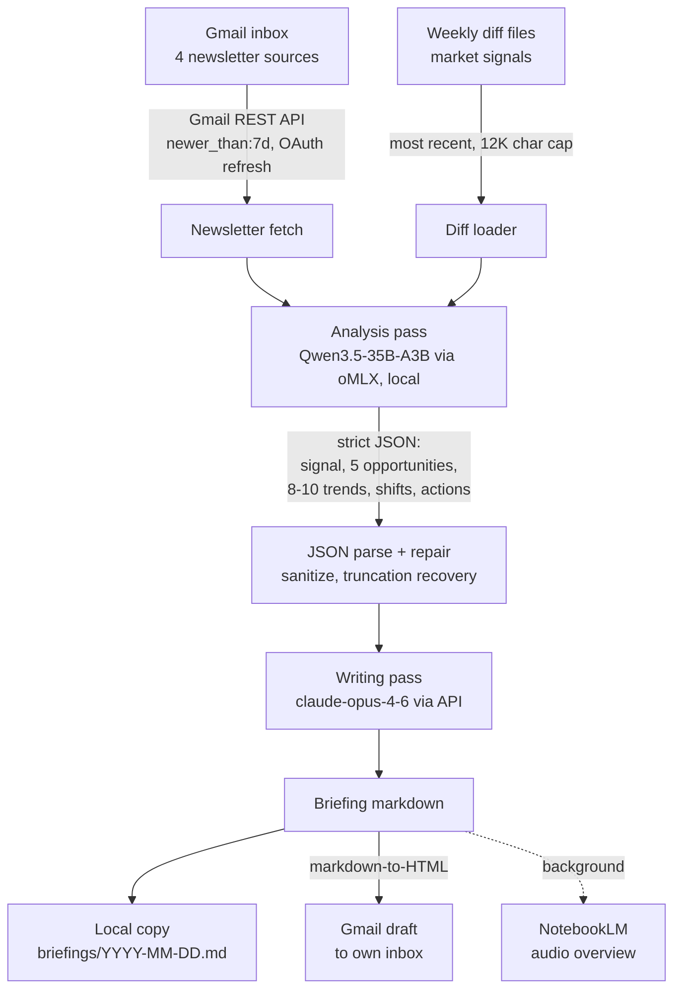

# weekly-briefings

AI-generated weekly intelligence briefings, synthesized from a curated newsletter stack by an automated Gmail-to-inbox pipeline. This repo holds the published output; the generator is a single Python script that runs unattended every Sunday.

## What it does

- Pulls the past 7 days of newsletters (Lenny's Newsletter, Gary Marcus, Nate's Newsletter, Sandhill East) directly from Gmail via the Gmail REST API, with OAuth token refresh handled in-script
- Merges in a "weekly diff" of structural market signals (GitHub trending, HN, funding data) produced by a separate weekly research job, capped at 12,000 characters
- Runs a local analysis pass on Qwen3.5-35B-A3B (4-bit, served by oMLX on localhost) that extracts strict JSON: one cross-source signal, exactly 5 build opportunities, 8-10 quantified trends, 2-4 structural shifts, and 3 actions
- Hands the structured analysis to claude-opus-4-6 for the final prose pass, in a fixed briefing format where every opportunity must anchor to a $10K MRR path
- Delivers the result as a Gmail draft (plain text plus HTML, converted by a purpose-built markdown renderer) and saves a local markdown copy
- Kicks off a background NotebookLM job that turns the week's diff into a podcast-style audio overview

The dated files in this repo (three ~3,200-3,400 word weekly briefings from April 2026, plus two monthly digests in `monthly/`) are real pipeline output, unedited.

## Why it exists

A good newsletter stack produces more reading than one person can process, and most of it is noise. The interesting part is what emerges across sources in the same week: when a practitioner newsletter, an AI skeptic, and GitHub trending data all point at the same shift, that convergence is the signal. This pipeline does the cross-source reading and returns one document per week with a thesis, concrete build opportunities, and numbers, instead of a stack of summaries.

## Architecture



Scheduled by a macOS LaunchAgent every Sunday at 8am. No servers, no framework: one Python file using only the standard library for HTTP, JSON, and MIME.

## Quick start

Read the output first. Any dated file (for example `2026-04-07.md`) shows what a full run produces.

To run the generator (lives in a separate scripts directory):

```bash
# Prerequisites:
# - Gmail OAuth token at ~/Workspace/scripts/gmail-automation/token.json
# - ANTHROPIC_API_KEY in ~/.config/ai/.env
# - oMLX serving Qwen3.5-35B-A3B on http://127.0.0.1:8000

python3 run.py                  # full pipeline: fetch -> analyze -> write -> draft
python3 notebooklm_audio.py     # audio overview only, from the latest weekly diff
```

## Design decisions

- Split the work by model economics. The heavy reading (up to 20,000 characters per newsletter, 10 messages per source) goes to a free local model. The frontier model only sees the distilled JSON and writes about 5,000 tokens of prose. One API call per week.
- Fetch Gmail directly, not through an agent. An earlier version shelled out to an interactive AI CLI with a Gmail MCP server; it could not authenticate headless under launchd and failed silently for weeks. The rewrite uses the Gmail REST API with an explicit token refresh path, per the docstring in `run.py`.
- Assume the local model's JSON is broken. The parser runs three stages: raw parse, whitespace-escape sanitization, then truncation repair that closes open braces at the last complete top-level value. Thinking mode is disabled explicitly (`chat_template_kwargs: {"enable_thinking": false}`) because reasoning models otherwise emit their planning monologue instead of JSON and run to the token cap.
- Constrain the output shape in the prompt, not in code. Opportunity counts, trend counts, the $10K MRR anchor, and the section order are all enforced by prompt rules; the samples in this repo show the constraint holding across runs.
- The section layout has evolved. The April 2026 samples in this repo use an earlier prompt template; the current `run.py` template emits Signal, Build Opportunity Scan, Trend Velocity, Structural Shifts, and Actions.

## Status

Active. The generator last changed on 2026-07-25 and produced its most recent briefing the week of 2026-07-21. The sample briefings and monthly digests in this repo are the proof of output quality; they are committed exactly as generated.
